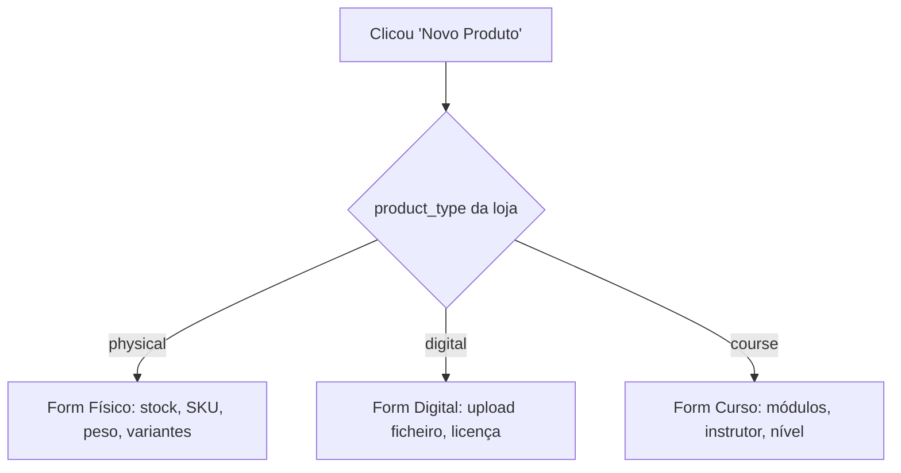

# 🏪 Proposta: Adaptação por Tipo de Loja

> **Data:** 26 de Julho de 2026  
> **Status:** Aguarda validação

---

## 1. Problema Actual

### 1.1 Dados repetidos entre formulários

O vendedor selecciona o **tipo de produto** duas vezes:

| Formulário | Campo | Onde |
|---|---|---|
| Registo da loja | `productType` (físico/digital/curso) | Step 1 — só usado para filtrar categorias |
| Criar produto | `productType` (físico/digital/curso) | Início do form — seleccionado manualmente |

O `productType` escolhido no registo **não é guardado** no modelo `Store` — perde-se após o registo.

### 1.2 Dashboard genérico

O painel do vendedor (`/seller/dashboard`) mostra os mesmos cards para todos os tipos de loja:
- "Vendas Hoje", "Receita Total", "Produtos Activos", "Pendentes", "Avaliação"

Uma loja de **cursos** não precisa de "Stock Baixo". Uma loja de **produtos digitais** não precisa de "Encomendas Pendentes" (download é imediato).

### 1.3 Sidebar igual para todos

O menu lateral (`SellerLayout`) é idêntico independentemente do tipo de loja. Uma loja de cursos poderia ter atalhos para "Alunos", "Certificados". Uma loja digital não precisa de gerir envios.

---

## 2. Solução Proposta

### 2.1 Adicionar `product_type` ao modelo `Store`

```python
# backend/apps/stores/models.py

class Store(BaseModel):
    PRODUCT_TYPE_CHOICES = [
        ('physical', 'Produtos Físicos'),
        ('digital', 'Produtos Digitais'),
        ('course', 'Cursos'),
    ]
    # ... campos existentes ...
    product_type = models.CharField(
        max_length=20,
        choices=PRODUCT_TYPE_CHOICES,
        default='physical',
        help_text='Tipo de produto que esta loja vende'
    )
```

### 2.2 Registo: guardar `product_type` + pré-configurações

No formulário de registo (`/seller/register`), ao submeter:

```typescript
fd.append('product_type', form.productType);
```

**Pré-configurações automáticas por tipo:**

| Tipo | Comissão afiliados | Alerta stock | Política envio sugerida |
|---|---|---|---|
| `physical` | 10% | 5 unidades | "Envio em 2-5 dias úteis" |
| `digital` | 15% | — (não aplicável) | "Download imediato após pagamento" |
| `course` | 20% | — (não aplicável) | "Acesso imediato à plataforma" |

### 2.3 Criar produto: adaptar ao tipo da loja

O formulário `/seller/products/new` **deixa de perguntar o tipo de produto**. Em vez disso:



**O que muda:**
- Remove o seletor "Tipo de Produto" do topo do formulário
- A categoria padrão já vem filtrada pelo tipo (ex: loja `course` só vê categorias de cursos)
- Campos específicos aparecem automaticamente
- O título da página reflecte o tipo: "Novo Produto Físico" / "Novo Curso" / "Novo Produto Digital"

### 2.4 Dashboard adaptado por tipo

| Card | `physical` | `digital` | `course` |
|---|---|---|---|
| Vendas Hoje | ✅ | ✅ | ✅ |
| Receita Total | ✅ | ✅ | ✅ |
| Produtos Activos | ✅ | ✅ | ✅ |
| Encomendas Pendentes | ✅ | ❌ (substituído por "Downloads Hoje") | ❌ (substituído por "Alunos Activos") |
| Stock Baixo | ✅ | ❌ | ❌ |
| Avaliação | ✅ | ✅ | ✅ |

**Novos cards por tipo:**

| Tipo | Cards exclusivos |
|---|---|
| `physical` | 📦 Stock Baixo, 🚚 Por Enviar |
| `digital` | ⬇️ Downloads Hoje, 🔑 Licenças Activas |
| `course` | 👨‍🎓 Alunos Activos, 🏆 Certificados Emitidos, 📊 Taxa Conclusão |

### 2.5 Sidebar adaptada

```typescript
// SellerLayout.tsx
const baseNavItems = [
  { href: '/seller/dashboard', label: 'Dashboard', icon: LayoutDashboard },
  { href: '/seller/products', label: 'Produtos', icon: Package },
  { href: '/seller/orders', label: 'Encomendas', icon: ShoppingCart },
  { href: '/seller/earnings', label: 'Ganhos', icon: DollarSign },
  { href: '/seller/settings', label: 'Configurações', icon: Settings },
];

const typeNavItems: Record<string, { href: string; label: string; icon: any }[]> = {
  physical: [
    { href: '/seller/affiliates', label: 'Afiliados', icon: Users },
  ],
  digital: [
    { href: '/seller/affiliates', label: 'Afiliados', icon: Users },
  ],
  course: [
    { href: '/seller/students', label: 'Alunos', icon: GraduationCap },
    { href: '/seller/certificates', label: 'Certificados', icon: Award },
    { href: '/seller/affiliates', label: 'Afiliados', icon: Users },
  ],
};

// Junção: base + específicos por tipo
const navItems = [...baseNavItems, ...(typeNavItems[productType] || [])];
```

---

## 3. Impacto no Backend

### 3.1 Migração necessária

```bash
python manage.py makemigrations stores
# Adiciona campo product_type ao modelo Store
```

### 3.2 Serializers afectados

| Serializer | Alteração |
|---|---|
| `StoreDetailSerializer` | Adicionar `product_type` aos campos |
| `StoreSerializer` | Adicionar `product_type` (read_only) |

### 3.3 API endpoints existentes — sem quebra

Nenhum endpoint precisa mudar de rota. Apenas:
- `GET /stores/me/` passa a retornar `product_type`
- `POST /stores/register/` passa a aceitar e guardar `product_type`

### 3.4 Novo endpoint (futuro)

```
GET /stores/me/stats/?type=course
```
Retorna estatísticas específicas por tipo (alunos, certificados, etc.)

---

## 4. Impacto no Frontend

### 4.1 Ficheiros a alterar

| Ficheiro | Mudança |
|---|---|
| `app/seller/register/page.tsx` | Enviar `product_type` no FormData |
| `app/seller/products/new/page.tsx` | Remover seletor de tipo, adaptar ao `product_type` da loja |
| `app/seller/dashboard/page.tsx` | Cards condicionais por tipo |
| `src/components/SellerLayout.tsx` | `navItems` dinâmicos por tipo |
| `src/lib/api.ts` | Adicionar `product_type` à interface `Store` |

### 4.2 Ficheiros novos

| Ficheiro | Descrição |
|---|---|
| `app/seller/students/page.tsx` | Lista de alunos (course only) |
| `app/seller/certificates/page.tsx` | Certificados emitidos (course only) |

---

## 5. Exemplo Visual: Criar Produto (Loja de Cursos)

**Antes** (sempre igual):
```
┌─────────────────────────────────────┐
│ Tipo de Produto                     │
│ [Físico] [Digital] [Curso]  ← sempre pergunta
├─────────────────────────────────────┤
│ Informações Básicas                 │
│ Nome, Descrição, Preço, Categoria   │
│ ...                                 │
└─────────────────────────────────────┘
```

**Depois** (loja de cursos):
```
┌─────────────────────────────────────┐
│ Novo Curso                          │  ← título adaptado
├─────────────────────────────────────┤
│ Informações do Curso                │
│ Nome do Curso *                     │
│ Descrição *                         │
│ Preço (MZN) *                       │
│ Categoria *  ← só categorias course │
│                                     │
│ ── Detalhes do Curso ──             │
│ Nome do Instrutor *                 │
│ Nível [Iniciante▾]                  │
│ Duração (ex: 20h)                   │
│ Nº de Aulas                         │
│                                     │
│ ── Imagens ──                       │
│ Capa do curso                       │
└─────────────────────────────────────┘
```

---

## 6. Plano de Implementação

### Fase 1 — Backend (1-2 horas)
- [ ] Adicionar `product_type` ao modelo `Store` + migração
- [ ] Actualizar `StoreDetailSerializer` para incluir o campo
- [ ] Guardar `product_type` no `StoreRegisterView`
- [ ] Popular lojas existentes (todas como `physical` por padrão)

### Fase 2 — Frontend Core (2-3 horas)
- [ ] `SellerLayout`: cachedStore incluir `product_type`, navItems dinâmicos
- [ ] `NewProductPage`: ler `product_type` da loja, remover seletor, adaptar campos
- [ ] `SellerRegisterPage`: enviar `product_type` no submit

### Fase 3 — Dashboard (2-3 horas)
- [ ] Cards condicionais por `product_type`
- [ ] Novos cards para digital (downloads) e course (alunos)
- [ ] API stats endpoint adaptado

### Fase 4 — Específicos por tipo (futuro)
- [ ] Página de Alunos (course)
- [ ] Página de Certificados (course)
- [ ] Gestão de licenças (digital)
- [ ] Gestão de envios/logística (physical)

---

## 7. Resumo

| Problema | Solução |
|---|---|
| `productType` seleccionado 2x e perdido | Guardar no modelo `Store`, usar como fonte única |
| Form de produto sempre igual | Adaptar campos automaticamente ao tipo da loja |
| Dashboard genérico | Cards e métricas específicas por tipo |
| Sidebar igual para todos | Itens condicionais (ex: "Alunos" só para cursos) |

---

> **Próximo passo:** Validar esta proposta. Após aprovação, implementar Fase 1.
