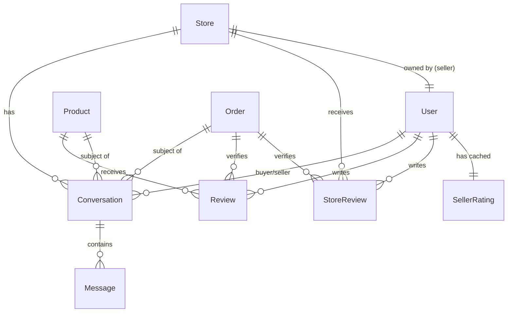

# Proposta: Chat & Avaliações — eShoppingCentre

> Data: 2026-08-06
> Estado: Proposta. Nada implementado.
> Escopo: Sistema de chat comprador↔vendedor + Avaliações de lojas, vendedores e produtos

---

# PARTE 1 — SISTEMA DE CHAT

## 1.1 Estado Actual

❌ **Zero.** Não existe qualquer forma de comunicação dentro da plataforma. O comprador não tem como contactar o vendedor.

---

## 1.2 Modelos Propostos

### `Conversation`

```python
class Conversation(BaseModel):
    buyer = models.ForeignKey(User, on_delete=models.CASCADE, related_name='conversations_as_buyer')
    seller = models.ForeignKey(User, on_delete=models.CASCADE, related_name='conversations_as_seller')
    store = models.ForeignKey(Store, on_delete=models.CASCADE, related_name='conversations')
    product = models.ForeignKey(Product, on_delete=models.SET_NULL, null=True, blank=True)
    order = models.ForeignKey(Order, on_delete=models.SET_NULL, null=True, blank=True)
    subject = models.CharField(max_length=500)
    last_message_at = models.DateTimeField(auto_now=True)
    is_archived_by_buyer = models.BooleanField(default=False)
    is_archived_by_seller = models.BooleanField(default=False)

    class Meta:
        ordering = ['-last_message_at']
        indexes = [
            models.Index(fields=['buyer', 'is_archived_by_buyer']),
            models.Index(fields=['seller', 'is_archived_by_seller']),
        ]
```

### `Message`

```python
class Message(BaseModel):
    conversation = models.ForeignKey(Conversation, on_delete=models.CASCADE, related_name='messages')
    sender = models.ForeignKey(User, on_delete=models.CASCADE)
    body = models.TextField()
    attachment = models.FileField(upload_to='chat/%Y/%m/', blank=True,
                                   help_text='Imagem ou documento (max 10MB)')
    is_read = models.BooleanField(default=False)
    read_at = models.DateTimeField(null=True, blank=True)

    class Meta:
        ordering = ['created_at']
```

---

## 1.3 Regras de Negócio

| Regra | Detalhe |
|-------|---------|
| **Quem pode iniciar conversa** | Qualquer comprador autenticado |
| **Contexto da conversa** | Sempre vinculada a uma loja (`store` FK). Opcionalmente a um `product` e/ou `order` |
| **Pré-venda** | `product` preenchido, `order` nulo — "Tenho dúvidas sobre este produto" |
| **Pós-venda** | `order` preenchido — "Onde está a minha encomenda?" |
| **Anexos** | Máx 1 por mensagem, 10MB, formatos: JPG, PNG, PDF |
| **Arquivamento** | Soft-delete por utilizador (cada lado arquiva independentemente) |
| **Bloqueio** | Seller pode bloquear buyer abusivo (não consegue criar novas conversas) |
| **Tempo de resposta** | Métrica visível na loja: "Responde em média em X horas" |

---

## 1.4 Endpoints

| Método | URL | Descrição |
|--------|-----|-----------|
| `GET` | `/api/v1/chat/` | Listar conversas do utilizador logado (comprador ou vendedor) |
| `POST` | `/api/v1/chat/` | Iniciar nova conversa |
| `GET` | `/api/v1/chat/{id}/` | Detalhe da conversa + mensagens |
| `POST` | `/api/v1/chat/{id}/messages/` | Enviar mensagem |
| `PATCH` | `/api/v1/chat/{id}/archive/` | Arquivar conversa |
| `PATCH` | `/api/v1/chat/{id}/unarchive/` | Desarquivar |
| `GET` | `/api/v1/chat/unread-count/` | Contagem de mensagens não lidas |

---

## 1.5 WebSockets (Tempo Real)

Para mensagens em tempo real sem polling, usar **Django Channels** com Redis:

| Rota WS | Descrição |
|---------|-----------|
| `ws/chat/{conversation_id}/` | Canal WebSocket da conversa |

### Fluxo:
1. Cliente conecta ao WebSocket com token JWT no handshake
2. Servidor valida que o utilizador pertence à conversa
3. Mensagens enviadas via WS são guardadas na BD e retransmitidas para o outro participante
4. Se o destinatário estiver offline, notificação push/email é disparada

### Fallback:
Se WebSocket falhar (firewall, proxy), polling a cada 15s no endpoint REST `GET /chat/{id}/` com `?since=<timestamp>`.

---

## 1.6 Notificações de Chat

| Evento | Canal |
|--------|-------|
| Nova mensagem (destinatário online) | WebSocket (tempo real) |
| Nova mensagem (destinatário offline) | Push notification + Email |
| Nova conversa iniciada (vendedor) | Push + Email: "Novo cliente quer falar sobre X" |
| Sem resposta há 24h | Lembrete para o vendedor |

---

## 1.7 Frontend — Onde colocar o chat

| Local | Gatilho |
|-------|---------|
| **Página de produto** | Botão "💬 Falar com o Vendedor" (abre chat pré-venda) |
| **Página da loja** (`/store/[slug]`) | Botão "💬 Contactar Loja" |
| **Página de encomenda** (`/account/orders/[id]`) | Botão "💬 Tenho uma dúvida sobre esta encomenda" |
| **Dashboard do seller** (`/seller/orders/[id]`) | Botão "💬 Falar com o Cliente" |
| **Header** | Ícone de mensagens com badge de não lidas |
| **`/account/messages`** | Central de mensagens do comprador |
| **`/seller/messages`** | Central de mensagens do vendedor |

### Widget de Chat (componente reutilizável):
- Painel lateral deslizante (slide-in, tipo Intercom)
- Lista de conversas à esquerda, mensagens à direita
- Input de texto + botão de anexo + emoji picker
- Indicador de "digitando..."
- Timestamps + "visto" (✓✓ azul quando lido)

---

## 1.8 Adaptações por Tipo de Loja

### Loja Física
- **Pré-venda**: Perguntas sobre tamanhos, cores, stock, entrega
- **Pós-venda**: Tracking, devoluções, garantia
- Botão visível em TODOS os produtos e na página da loja

### Loja Digital
- **Pré-venda**: Compatibilidade, formato, licença
- **Pós-venda**: Problemas com download, nova versão
- Anexo frequente: screenshots de erro

### Loja de Cursos
- **Pré-venda**: Conteúdo programático, pré-requisitos, certificado
- **Pós-venda**: Dúvidas sobre aulas, acesso expirado
- **Alternativa**: Considerar **Q&A por aula** (thread pública) vs chat privado — são complementares

---

## 1.9 Fases de Implementação

| Fase | Escopo |
|------|--------|
| **Fase 1** | REST API: modelos, CRUD de conversas e mensagens, endpoints |
| **Fase 2** | Frontend: widget de chat, central de mensagens, badge no header |
| **Fase 3** | WebSockets com Django Channels + Redis |
| **Fase 4** | Notificações push + email de novas mensagens |
| **Fase 5** | Métricas: tempo médio de resposta por loja, exibição pública |

---

# PARTE 2 — SISTEMA DE AVALIAÇÕES

## 2.1 Estado Actual

| O que existe | Estado |
|-------------|--------|
| `Review` (produto) | ✅ Modelo, serializer, views básicas |
| `Store.rating` | ✅ Campo Decimal (atualizado manualmente?) |
| `Product.rating` + `review_count` | ✅ Campos no modelo Product |
| Avaliação de loja | ❌ Não existe |
| Avaliação de vendedor (seller) | ❌ Não existe |
| Avaliação de curso (aluno→curso) | ❌ Não existe (review de produto cobre, mas sem lógica pós-curso) |
| Resposta do vendedor à review | ❌ Não existe |
| Denúncia de review abusiva | ❌ Não existe |
| Selo "Compra verificada" | ✅ Campo `is_verified_purchase` existe mas não é preenchido automaticamente |

---

## 2.2 Modelos Propostos

### Manter e melhorar: `Review` (já existe)

Adicionar campos:
```python
# A adicionar ao modelo Review existente:
seller_reply = models.TextField(blank=True)
seller_replied_at = models.DateTimeField(null=True, blank=True)
report_count = models.PositiveIntegerField(default=0)
is_hidden = models.BooleanField(default=False)  # admin pode esconder
```

### Novo: `StoreReview`

```python
class StoreReview(BaseModel):
    user = models.ForeignKey(User, on_delete=models.CASCADE, related_name='store_reviews')
    store = models.ForeignKey(Store, on_delete=models.CASCADE, related_name='reviews')
    order = models.ForeignKey(Order, on_delete=models.SET_NULL, null=True)

    # Dimensões de avaliação (1-5 estrelas cada)
    communication_rating = models.PositiveSmallIntegerField()   # Comunicação
    shipping_rating = models.PositiveSmallIntegerField(null=True)  # Entrega (só físicas)
    accuracy_rating = models.PositiveSmallIntegerField()        # Precisão da descrição
    overall_rating = models.PositiveSmallIntegerField()         # Geral

    title = models.CharField(max_length=255, blank=True)
    comment = models.TextField()
    is_verified_purchase = models.BooleanField(default=False)
    helpful_count = models.PositiveIntegerField(default=0)

    seller_reply = models.TextField(blank=True)
    seller_replied_at = models.DateTimeField(null=True, blank=True)
    report_count = models.PositiveIntegerField(default=0)
    is_hidden = models.BooleanField(default=False)

    class Meta:
        unique_together = [['user', 'store']]  # Uma avaliação por loja por utilizador
```

### Novo: `SellerRating` (aggregado, cache)

```python
class SellerRating(BaseModel):
    """Cache agregado de ratings do vendedor — atualizado por signals."""
    user = models.OneToOneField(User, on_delete=models.CASCADE, related_name='seller_rating')
    # Agregados de StoreReview (média de todas as lojas do vendedor)
    avg_communication = models.DecimalField(max_digits=3, decimal_places=2, default=0)
    avg_shipping = models.DecimalField(max_digits=3, decimal_places=2, default=0)
    avg_accuracy = models.DecimalField(max_digits=3, decimal_places=2, default=0)
    avg_overall = models.DecimalField(max_digits=3, decimal_places=2, default=0)
    total_reviews = models.PositiveIntegerField(default=0)
    response_rate = models.DecimalField(max_digits=5, decimal_places=2, default=0)  # % de reviews respondidas
    avg_response_time_hours = models.DecimalField(max_digits=6, decimal_places=1, default=0)
```

---

## 2.3 Adaptações por Tipo de Loja

### Loja Física
**Dimensões avaliadas:**
- ⭐ Comunicação (30%) — O vendedor respondeu rápido? Foi claro?
- ⭐ Entrega (30%) — Chegou no prazo? Embalagem adequada?
- ⭐ Precisão (25%) — O produto corresponde à descrição e fotos?
- ⭐ Geral (15%) — Satisfação global

### Loja Digital
**Dimensões avaliadas:**
- ⭐ Comunicação (30%)
- ⭐ Qualidade do Produto (35%) — O ficheiro funciona? É o que foi anunciado?
- ⭐ Precisão (25%) — Descrição e screenshots correspondem?
- ⭐ Geral (10%)

**Nota:** Sem `shipping_rating` — campo fica `null`.

### Loja de Cursos
**Dimensões avaliadas:**
- ⭐ Conteúdo (30%) — O curso entrega o que promete?
- ⭐ Didática (25%) — O instrutor explica bem?
- ⭐ Comunicação (20%) — Suporte e respostas do instrutor
- ⭐ Geral (25%)

**Quem pode avaliar:** Só alunos que concluíram ≥ 50% do curso. A review é do curso como produto, não há `StoreReview` separada para cursos — usa-se a `Review` de produto existente.

---

## 2.4 Endpoints

### Reviews de Produto (já existem, a melhorar)

| Método | URL | Descrição |
|--------|-----|-----------|
| `GET` | `/api/v1/reviews/product/?product=<id>` | Listar reviews do produto (✅ existe) |
| `POST` | `/api/v1/reviews/` | Criar review (✅ existe) |
| `PATCH` | `/api/v1/reviews/{id}/` | Editar a minha review |
| `DELETE` | `/api/v1/reviews/{id}/` | Remover a minha review |
| `POST` | `/api/v1/reviews/{id}/reply/` | Vendedor responde à review |
| `POST` | `/api/v1/reviews/{id}/report/` | Denunciar review |
| `POST` | `/api/v1/reviews/{id}/helpful/` | Marcar como útil |

### Reviews de Loja (novo)

| Método | URL | Descrição |
|--------|-----|-----------|
| `GET` | `/api/v1/stores/{slug}/reviews/` | Listar reviews da loja |
| `POST` | `/api/v1/stores/{id}/review/` | Avaliar loja |
| `PATCH` | `/api/v1/stores/reviews/{id}/` | Editar a minha avaliação |
| `POST` | `/api/v1/stores/reviews/{id}/reply/` | Vendedor responde |

### Ratings do Vendedor (novo, read-only)

| Método | URL | Descrição |
|--------|-----|-----------|
| `GET` | `/api/v1/sellers/{id}/rating/` | Rating agregado do vendedor |
| `GET` | `/api/v1/stores/{slug}/rating/` | Rating agregado da loja |

---

## 2.5 Regras de Negócio

### Quem pode avaliar
| Entidade | Regra |
|----------|-------|
| **Produto físico/digital** | Só depois de compra confirmada (`is_verified_purchase=True` automático) |
| **Curso** | Só após ≥ 50% de progresso OU curso concluído |
| **Loja** | Só após pelo menos 1 compra concluída nessa loja |

### Preenchimento automático de `is_verified_purchase`
No acto de criação da review, verificar se `OrderItem` existe para `user` + `product` com `order.status IN ('delivered', 'completed')`.

### Actualização de ratings agregados
Via **Django signals** (`post_save`, `post_delete` no `Review` e `StoreReview`):
- Recalcular `Product.rating` e `Product.review_count`
- Recalcular `Store.rating`
- Recalcular `SellerRating`

### Resposta do vendedor
- Uma resposta por review
- Pode editar a resposta
- Notificação para o comprador quando a resposta é publicada
- Exibida inline abaixo da review

### Denúncia de review
- Qualquer utilizador pode denunciar
- `report_count` incrementado
- Se ≥ 3 denúncias, review é ocultada automaticamente (`is_hidden=True`) e notifica admin
- Admin pode reverter ou banir review

### Prevenção de abuso
- Máximo 1 review por produto por utilizador (✅ já existe com `unique_together`)
- Máximo 1 store review por loja por utilizador
- Delay de 24h após entrega antes de permitir review (evita reviews por impulso)
- Reviews com texto < 10 caracteres são rejeitadas

---

## 2.6 Frontend

### Página de Produto
- Secção "Avaliações" com:
  - ⭐ Média + gráfico de distribuição (5★: 60%, 4★: 25%, ...)
  - Lista de reviews com avatar, nome, data, estrelas, comentário
  - Resposta do vendedor inline (destacada com fundo diferente)
  - Filtro: "Mais recentes", "Mais úteis", "5 estrelas", "Com fotos"
  - Botão "Útil 👍" em cada review

### Página da Loja
- Secção "Avaliações da Loja" com:
  - Média geral + breakdown por dimensão (comunicação, entrega, precisão)
  - Gráfico de barras por dimensão
  - Selo "Compra verificada" nas reviews

### Pós-compra / Pós-curso
- Email automático 3 dias após entrega: "Como foi a sua experiência? Avalie o produto e a loja."
- Popup "Avalie a sua compra" ao visitar `/account/orders`
- Badge "Por avaliar" nos itens pendentes

### Dashboard do Vendedor
- Secção "Avaliações" com:
  - Média geral e por dimensão
  - Últimas reviews recebidas
  - Botão "Responder" em cada review sem resposta
  - Gráfico de evolução do rating ao longo do tempo

---

## 2.7 Fases de Implementação

| Fase | Escopo |
|------|--------|
| **Fase 1** | Melhorar `Review` existente: `is_verified_purchase` automático, signals de rating |
| **Fase 2** | `StoreReview` — modelo, endpoints, lógica de avaliação multi-dimensão |
| **Fase 3** | `SellerRating` — cache agregado, página pública de rating do vendedor |
| **Fase 4** | Resposta do vendedor + denúncia de reviews |
| **Fase 5** | Frontend completo: breakdown de estrelas, filtros, gráficos |
| **Fase 6** | Email pós-compra + popup de avaliação |

---

## 📊 Diagrama de Relacionamentos



---

## 🎯 Resumo de Prioridades

| # | O quê | Porquê |
|---|-------|--------|
| 1 | **Chat REST API** | MVP — comunicação básica comprador↔vendedor |
| 2 | **Fix `is_verified_purchase`** | Reviews sem verificação não têm credibilidade |
| 3 | **`StoreReview` multi-dimensão** | Padrão Amazon/Mercado Livre — lojas precisam de reputação |
| 4 | **Resposta do vendedor** | Transparência — vendedor pode defender-se |
| 5 | **WebSocket chat** | Experiência em tempo real |
| 6 | **`SellerRating` cache** | Performance — evitar queries pesadas em cada page load |
